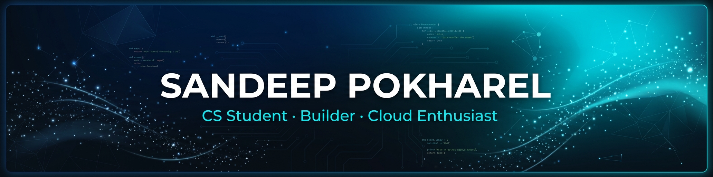

  <!-- HERO BANNER -->
  

   

  <!-- ANIMATED TYPING SVG -->
  

    

  <!-- SOCIAL BADGES -->
  
  
  

<!-- ───────────────────────────────────────────── -->

## 👨‍💻 About Me

I'm a Computer Science student who also works in campus IT Support. Because of my IT background, I care deeply about the user experience. I focus on building modern web apps, cloud systems, and automation tools that are reliable, practical, and genuinely helpful for the people using them.

- 🎓 **CS Sophomore** @ Dakota State University
- 📍 Based in **Madison, SD**
- 🔭 Currently building **production-minded projects** and learning in public
- 🌱 Exploring **cloud infrastructure**, **DevOps**, and **full-stack development**
- 🤖 Diving into **AI/ML**, **Generative AI (LLMs)**, and **AI Agents & Automation**
- ⚡ Fun fact: I believe the best code is the code that actually ships

 

<!-- ───────────────────────────────────────────── -->

## 🛠️ Tech Stack

**Languages**

  

**Frameworks & Libraries**

  

**DevOps & Cloud**

  

**AI & Automation**

  

**Databases & BaaS**

  

**Other Tools & Platforms**

 

<!-- ───────────────────────────────────────────── -->

## 🚀 Featured Projects

<table>
  <tr>
    <td width="33%" valign="top">
      <h3 align="center">🌐 Portfolio</h3>
      

        A cinematic, recruiter-focused portfolio with a real-time AI assistant and a responsive, motion-rich experience.
      

      
<code>React · Vite · Tailwind · GSAP · Docker</code>

      

        
        
      

    </td>
    <td width="33%" valign="top">
      <h3 align="center">🧠 Molecular Zettelkasten</h3>
      

        An AI knowledge workspace that turns an Obsidian vault into a searchable, source-aware second brain.
      

      
<code>Next.js · Gemini · Firebase · Semantic RAG · AWS</code>

      

        
      

    </td>
    <td width="33%" valign="top">
      <h3 align="center">📚 Personal Wiki Template</h3>
      

        A ready-to-use personal knowledge wiki template for organizing notes, research, and documentation.
      

      
<code>Markdown · Wiki · Knowledge Management</code>

      

        
      

    </td>
  </tr>
</table>

 

<!-- ───────────────────────────────────────────── -->

## 📊 GitHub Stats

  
  &nbsp;&nbsp;
  

    

  

 

<!-- ───────────────────────────────────────────── -->

## 🐍 Contribution Graph

  <picture>
    <source media="(prefers-color-scheme: dark)" srcset="https://raw.githubusercontent.com/pokharelsandeep333-commits/pokharelsandeep333-commits/output/github-snake-dark.svg" />
    <source media="(prefers-color-scheme: light)" srcset="https://raw.githubusercontent.com/pokharelsandeep333-commits/pokharelsandeep333-commits/output/github-snake.svg" />
    
  </picture>

 

<!-- ───────────────────────────────────────────── -->

  

    

  Built with curiosity, shipped with care.

